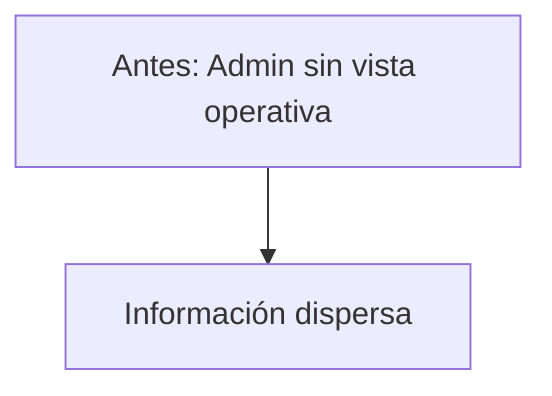
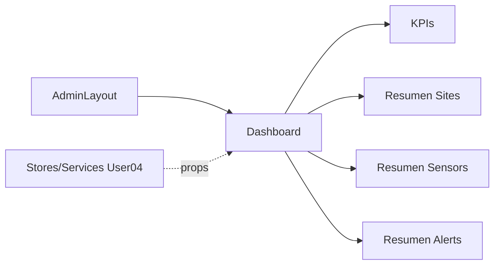
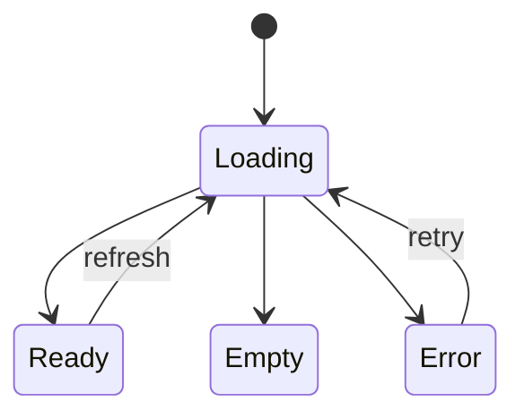

# Diagrama — Issue 06

```mermaid
flowchart TD
 A[Antes: Admin sin vista operativa] --> B[Información dispersa]
```

```mermaid
flowchart LR
 A[AdminLayout] --> B[Dashboard]
 B --> C[KPIs]
 B --> D[Resumen Sites]
 B --> E[Resumen Sensors]
 B --> F[Resumen Alerts]
G[Stores/Services User04] -. props .-> B
```

## Estados de una sección

```mermaid
stateDiagram-v2
 [*] --> Loading
 Loading --> Ready
 Loading --> Empty
 Loading --> Error
 Ready --> Loading: refresh
 Error --> Loading: retry
```
