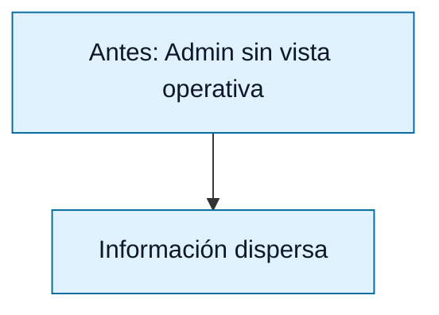
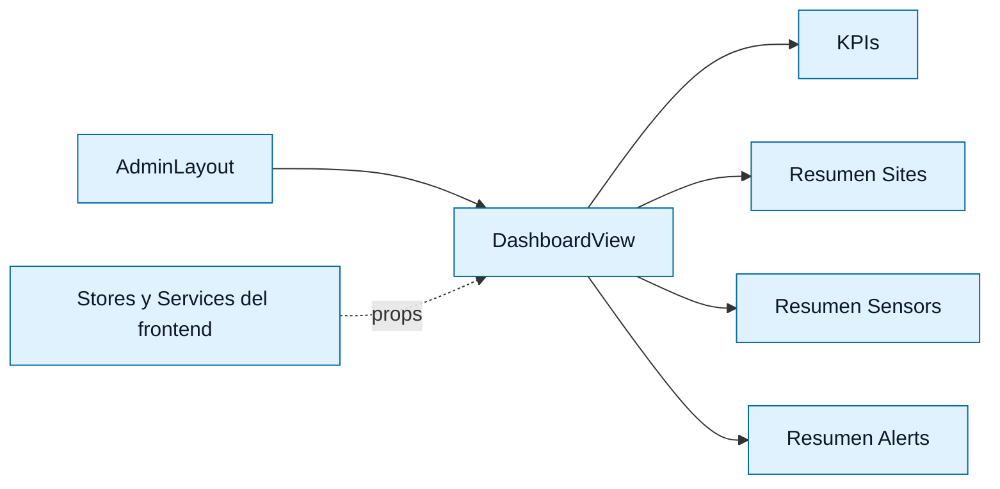
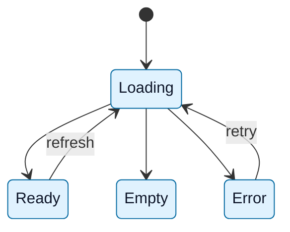
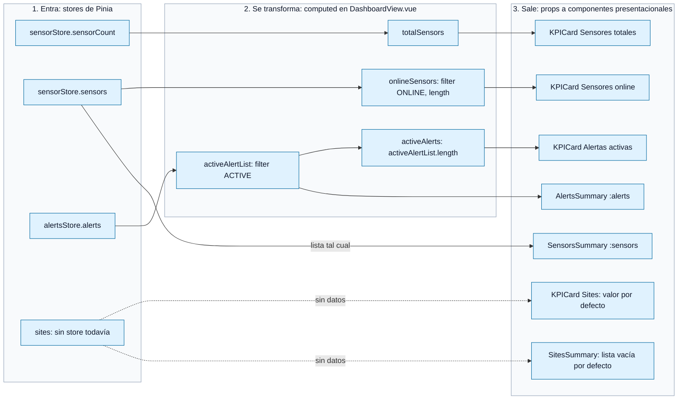
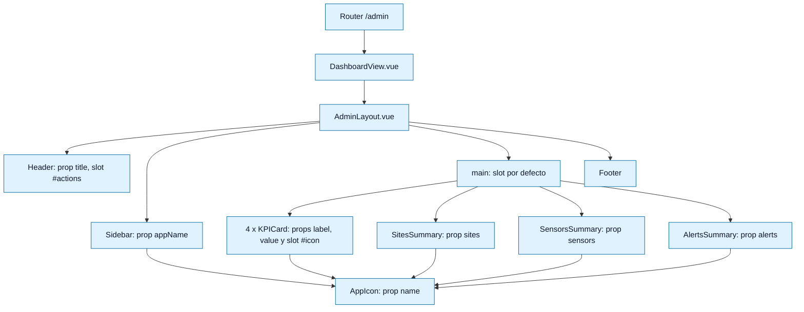
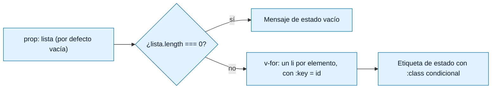

# Diagrama — Issue 06 (Dashboard Admin)

## Estados de una sección

## Flujo de datos implementado

Regla general: **los datos bajan, nunca se piden**. Los stores de Pinia guardan los datos, la vista los prepara y los componentes solo los pintan.

| Fase | Qué es | Ejemplo |
|---|---|---|
| **Entra** | Listas del store, con el shape del backend | `[{ id, name, status: 'ONLINE', ... }]` |
| **Se transforma** | `computed`: filtra o cuenta, y se recalcula solo cuando cambia el store | `alertsStore.alerts.filter(a => a.status === 'ACTIVE')` |
| **Sale** | Props hacia componentes que solo pintan | `<AlertsSummary :alerts="activeAlertList" />` |

## Cómo se compone la página

## Dentro de cada resumen

Los tres resúmenes siguen el mismo patrón:

| Componente | Recibe | Etiqueta |
|---|---|---|
| `SitesSummary` | `sites` | — (nombre y dirección) |
| `SensorsSummary` | `sensors` | `ONLINE` verde / `OFFLINE` gris |
| `AlertsSummary` | `alerts` (solo `ACTIVE`) | `CRITICAL` rojo / `WARNING` ámbar |

## Qué NO hace ningún componente

- No importa `axios` ni llama a `/api/...` (criterio: sin HTTP directo).
- No llama a `fetchSensors()` ni a otras acciones de carga: la carga de datos en los stores pertenece a los issues de integración de stores y services ("Integrar Sensors y Readings con Services/Stores", #34, y "Implementar sensores, alertas, tablas y filtros de Admin").
- No reconoce ni resuelve alertas: la gestión funcional de alertas pertenece al issue "Implementar sensores, alertas, tablas y filtros de Admin" (frontend) y al #28 (endpoints de alertas, backend).
- No decide de dónde vienen los datos: si mañana llegan de la API real, los componentes no cambian.
