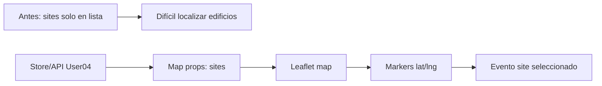
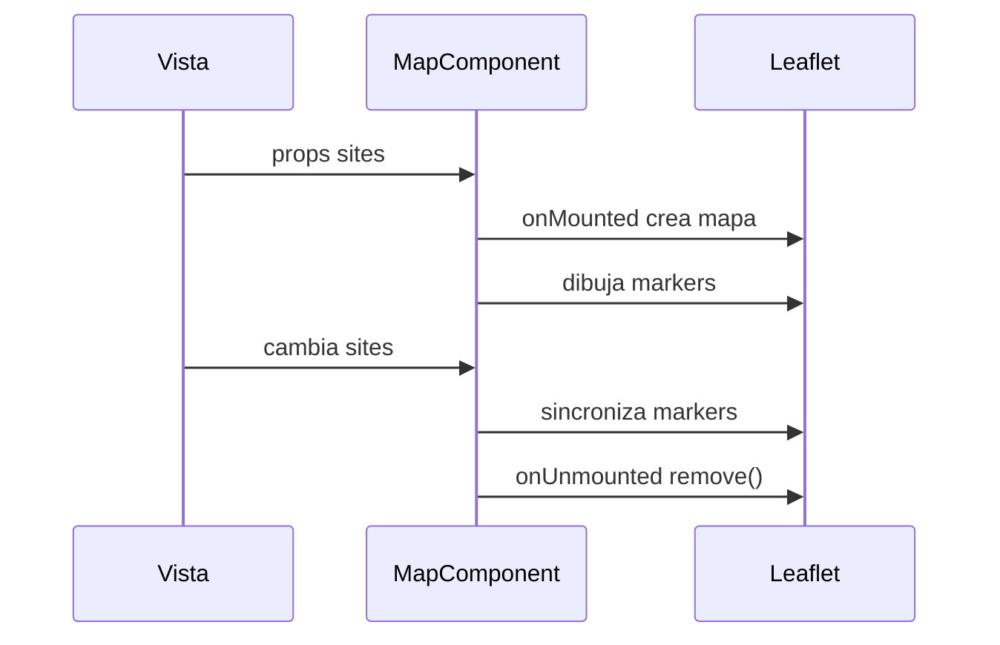

# Diagrama — Issue 07

```mermaid
flowchart LR
 A[Antes: sites solo en lista] --> B[Difícil localizar edificios]
 C[Store/API User04] --> D[Map props: sites]
 D --> E[Leaflet map]
 E --> F[Markers lat/lng]
F --> G[Evento site seleccionado]
```

## Ciclo de vida

```mermaid
sequenceDiagram
 participant V as Vista
 participant M as MapComponent
 participant L as Leaflet
 V->>M: props sites
 M->>L: onMounted crea mapa
 M->>L: dibuja markers
 V->>M: cambia sites
 M->>L: sincroniza markers
 M->>L: onUnmounted remove()
```
