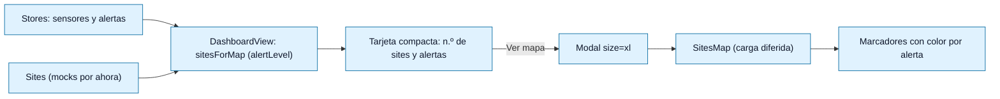
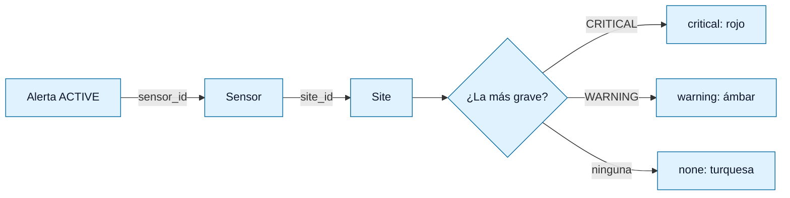
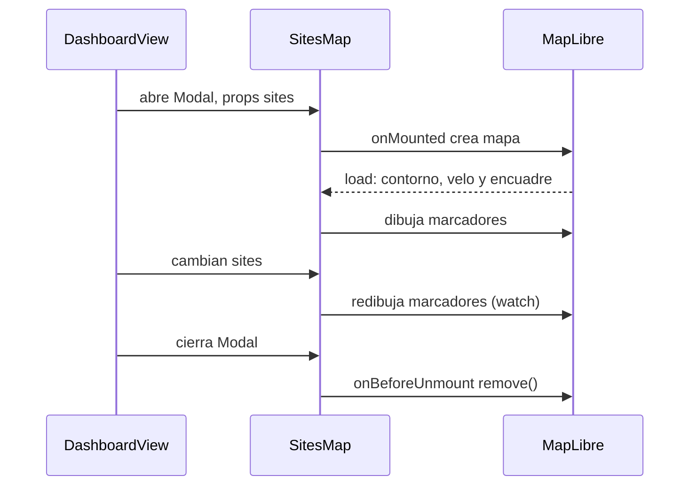

# Diagrama — Issue 07

```mermaid
flowchart LR
 A["Stores: sensores y alertas"] --> C["DashboardView: sitesForMap (alertLevel)"]
 B["Sites (mocks por ahora)"] --> C
 C --> D["Tarjeta compacta: n.º de sites y alertas"]
 D -- "Ver mapa" --> E["Modal size=xl"]
 E --> F["SitesMap (carga diferida)"]
 F --> G["Marcadores con color por alerta"]

 classDef default fill:#e0f2fe,stroke:#0369a1,color:#0f172a
```

## Nivel de alerta de un site

```mermaid
flowchart LR
 A["Alerta ACTIVE"] -- sensor_id --> B[Sensor]
 B -- site_id --> C[Site]
 C --> D{"¿La más grave?"}
 D -- CRITICAL --> E[critical: rojo]
 D -- WARNING --> F[warning: ámbar]
 D -- ninguna --> G[none: turquesa]

 classDef default fill:#e0f2fe,stroke:#0369a1,color:#0f172a
```

## Ciclo de vida

```mermaid
sequenceDiagram
 participant V as DashboardView
 participant M as SitesMap
 participant L as MapLibre
 V->>M: abre Modal, props sites
 M->>L: onMounted crea mapa
 L-->>M: load: contorno, velo y encuadre
 M->>L: dibuja marcadores
 V->>M: cambian sites
 M->>L: redibuja marcadores (watch)
 V->>M: cierra Modal
 M->>L: onBeforeUnmount remove()
```
