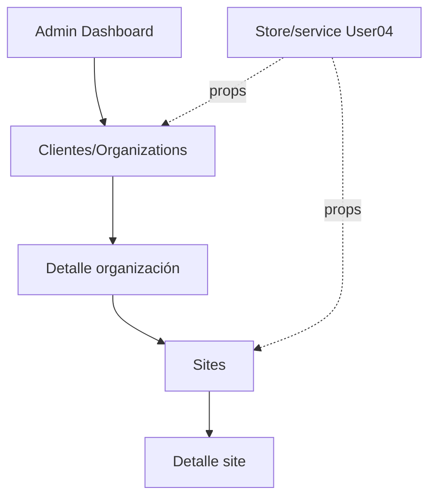
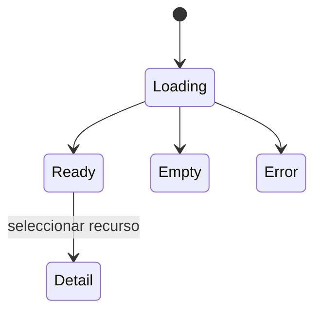

# Diagrama — Issue 08

```mermaid
flowchart TD
 A[Admin Dashboard] --> B[Clientes/Organizations]
 B --> C[Detalle organización]
 C --> D[Sites]
 D --> E[Detalle site]
 F[Store/service User04] -. props .-> B
F -. props .-> D
```

## Estados de colección

```mermaid
stateDiagram-v2
 [*] --> Loading
 Loading --> Ready
 Loading --> Empty
 Loading --> Error
 Ready --> Detail: seleccionar recurso
```

Antes: recursos aislados o repetidos. Después: navegación visual jerárquica y componentes compartidos.
