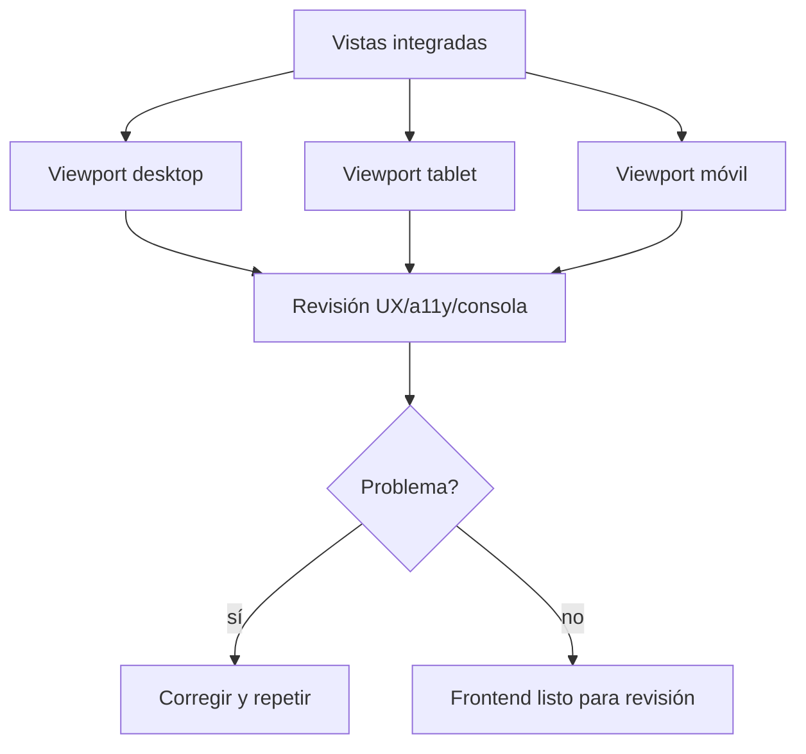
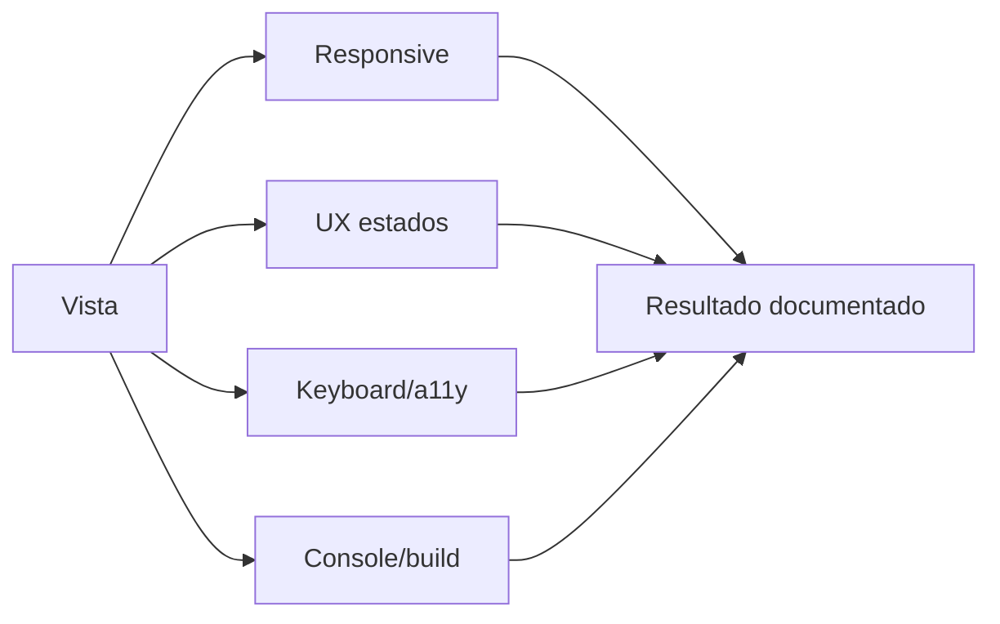

# Diagrama — Issue 09

```mermaid
flowchart TD
 A[Vistas integradas] --> B[Viewport desktop]
 A --> C[Viewport tablet]
 A --> D[Viewport móvil]
 B --> E[Revisión UX/a11y/consola]
 C --> E
 D --> E
 E --> F{Problema?}
 F -- sí --> G[Corregir y repetir]
 F -- no --> H[Frontend listo para revisión]
```

Antes: cada vista funcionaba solo en su contexto. Después: experiencia validada transversalmente.

## Matriz de calidad

```mermaid
flowchart LR
 A[Vista] --> B[Responsive]
 A --> C[UX estados]
 A --> D[Keyboard/a11y]
 A --> E[Console/build]
 B --> F[Resultado documentado]
 C --> F
 D --> F
 E --> F
```
