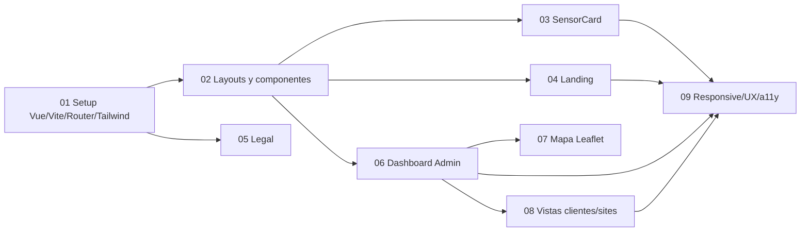

# Documentación de issues de Florinda

Esta documentación corresponde a las 9 issues definidas en [`scripts/create_florinda_issues.sh`](../../scripts/create_florinda_issues.sh). Cada carpeta contiene:

- `01-issue.md`: contexto, objetivo, alcance, dependencias y aceptación.
- `02-conceptos.md`: conceptos aislados y relacionados, con tiempo de aprendizaje.
- `03-diagrama.md`: flujo antes/después en Mermaid.
- `04-implementacion.md`: implementación por fases, pruebas y errores frecuentes.

## Orden recomendado

User04 proporciona stores, services, mocks y auth; Florinda construye la presentación y la experiencia visual. Los contratos de datos deben acordarse antes de integrar.

