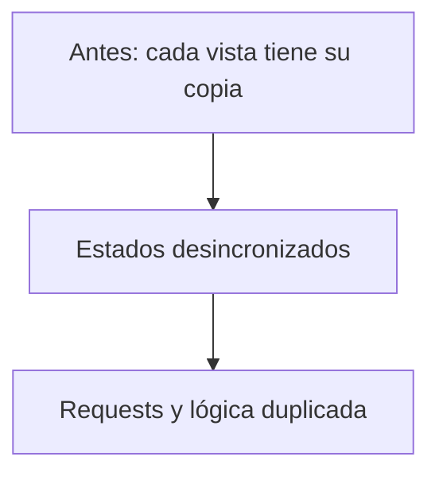
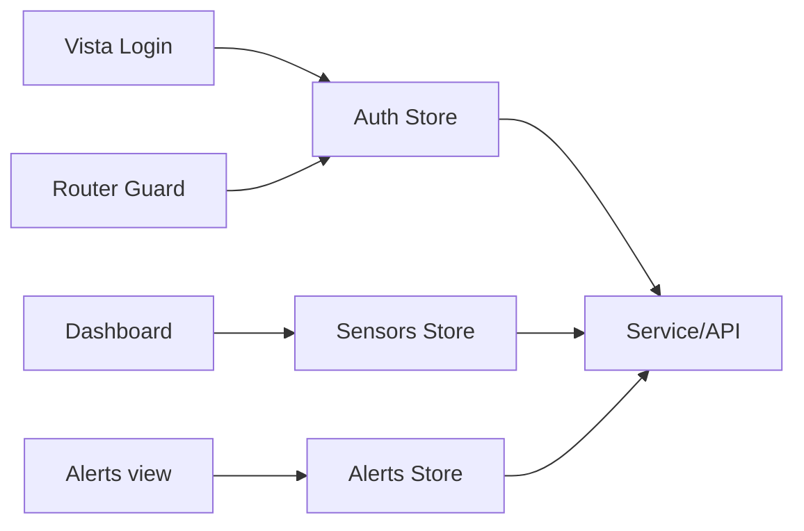
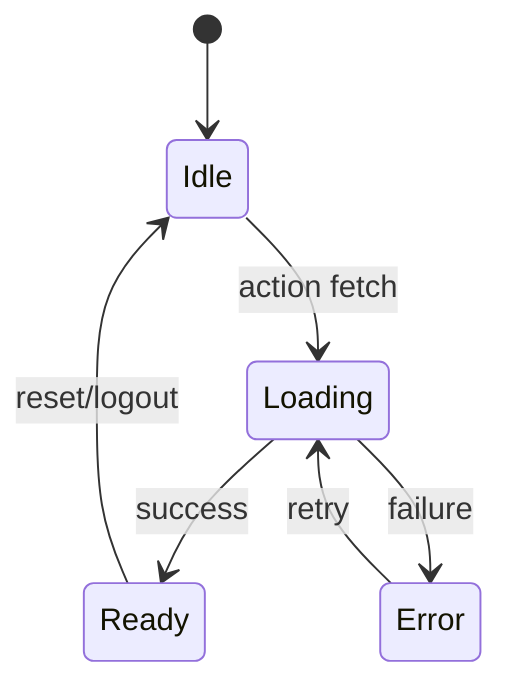

# Diagrama — Issue 01

```mermaid
flowchart TD
 A[Antes: cada vista tiene su copia] --> B[Estados desincronizados]
 B --> C[Requests y lógica duplicada]
```

```mermaid
flowchart LR
 V1[Vista Login] --> A[Auth Store]
 V2[Router Guard] --> A
 V3[Dashboard] --> S[Sensors Store]
 V4[Alerts view] --> L[Alerts Store]
 A --> X[Service/API]
 S --> X
 L --> X
```

## Ciclo de estado

```mermaid
stateDiagram-v2
 [*] --> Idle
 Idle --> Loading: action fetch
 Loading --> Ready: success
 Loading --> Error: failure
 Error --> Loading: retry
 Ready --> Idle: reset/logout
```
