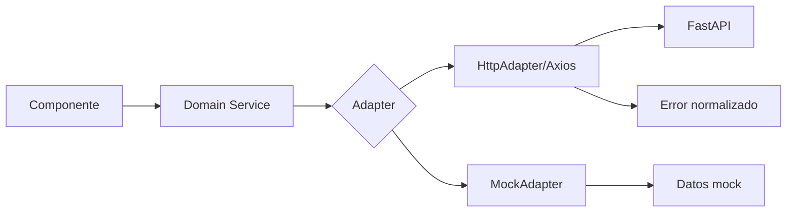
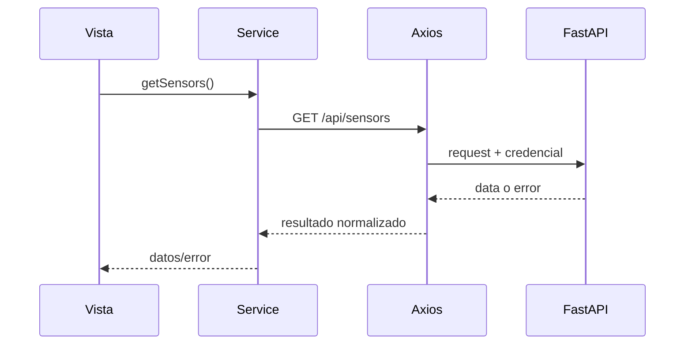

# Diagrama — Issue 02

Antes: cada componente construye requests. Después: una frontera sustituible y consistente.

## Request

El adapter oculta el transporte; la vista solo conoce la operación y el resultado.
