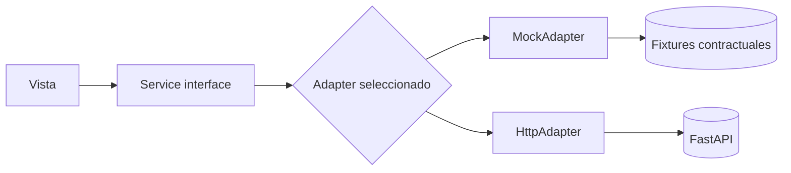
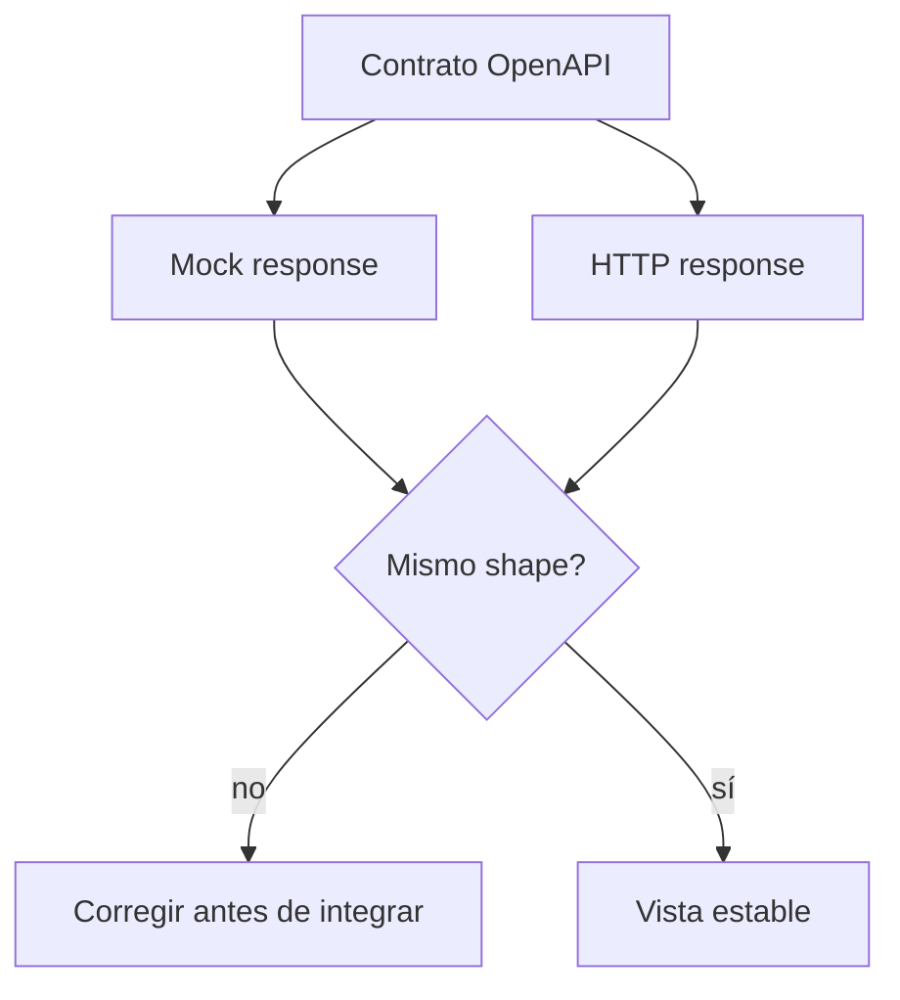

# Diagrama — Issue 03

Antes: vistas dependen de datos inventados. Después: una interfaz permite cambiar fuente sin cambiar UI.

## Paridad

La paridad de shape es más importante que tener muchos registros demo.
