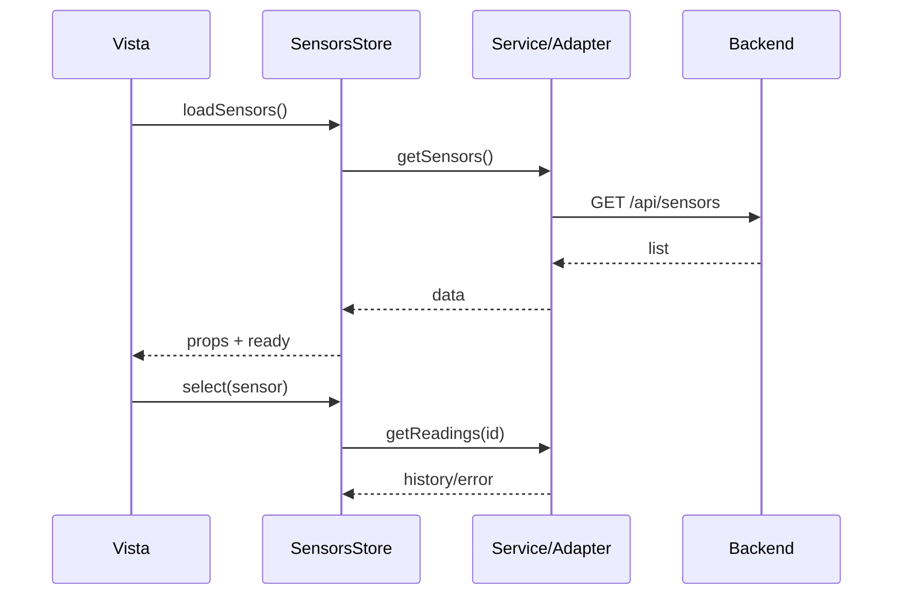

# Diagrama — Issue 04

```mermaid
sequenceDiagram
 participant V as Vista
 participant S as SensorsStore
 participant API as Service/Adapter
 participant B as Backend
 V->>S: loadSensors()
 S->>API: getSensors()
 API->>B: GET /api/sensors
 B-->>API: list
 API-->>S: data
 S-->>V: props + ready
 V->>S: select(sensor)
 S->>API: getReadings(id)
 API-->>S: history/error
```

Antes: UI dependía de mocks locales. Después: el origen cambia detrás del store.

El store actúa como frontera reactiva entre el transporte y la presentación.
