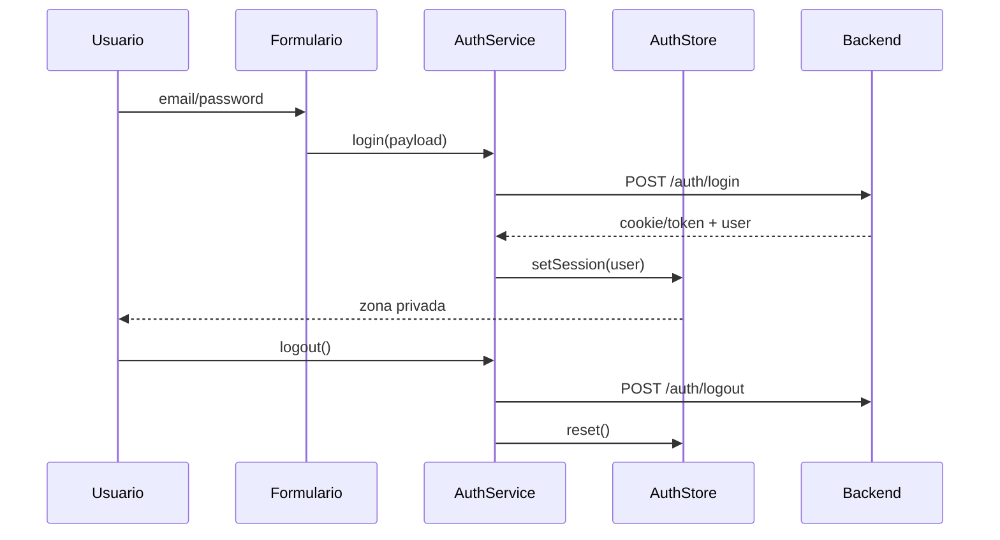

# Diagrama — Issue 05

La credencial se transporta según la decisión del proyecto; la UI no debe inventar una segunda estrategia.

Antes: formularios aislados. Después: sesión compartida y navegable.
