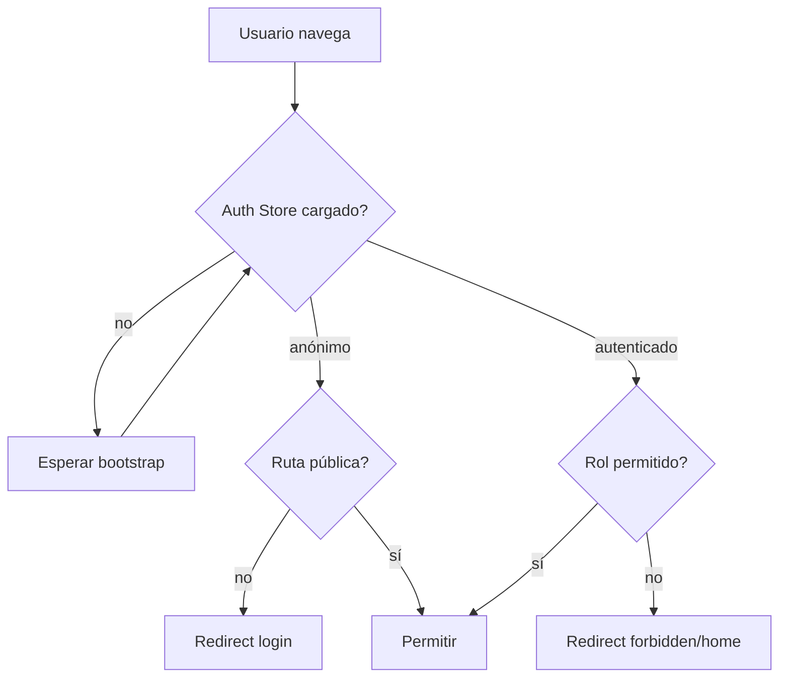

# Diagrama — Issue 06

Antes: cualquier usuario podía navegar por URL. Después: UX guiada por auth/rol; seguridad final en backend.

El guard debe devolver una decisión de navegación, no realizar mutaciones de datos.
