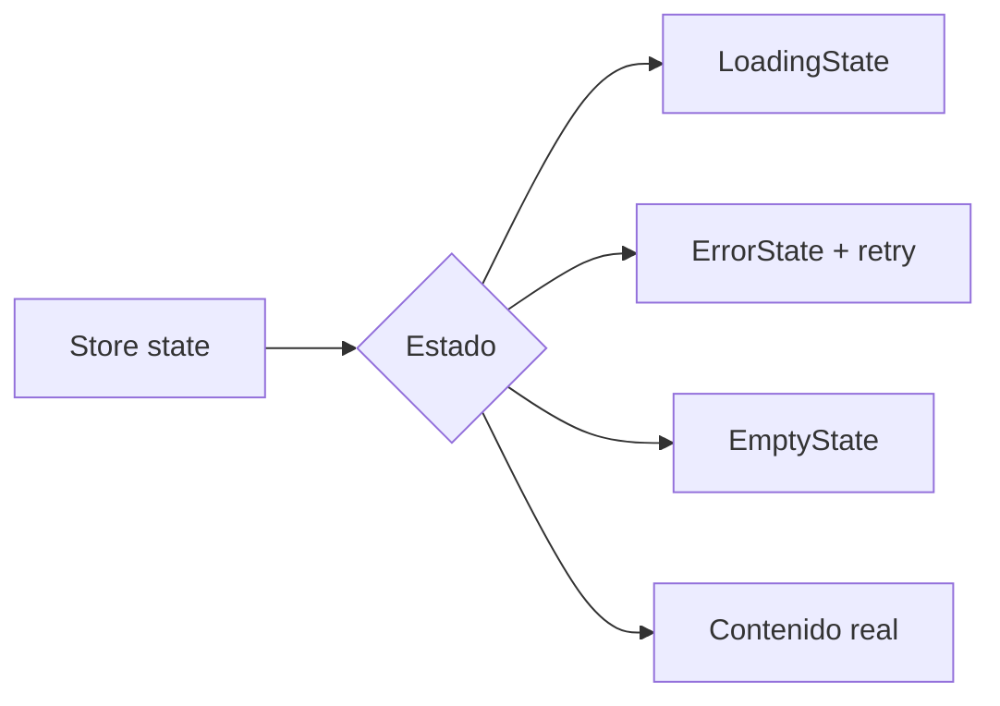

# Diagrama — Issue 07

Antes: cada vista resuelve estados de forma distinta. Después: feedback consistente conectado a una máquina de estados.

El store controla transición; el componente controla solo presentación y eventos.
