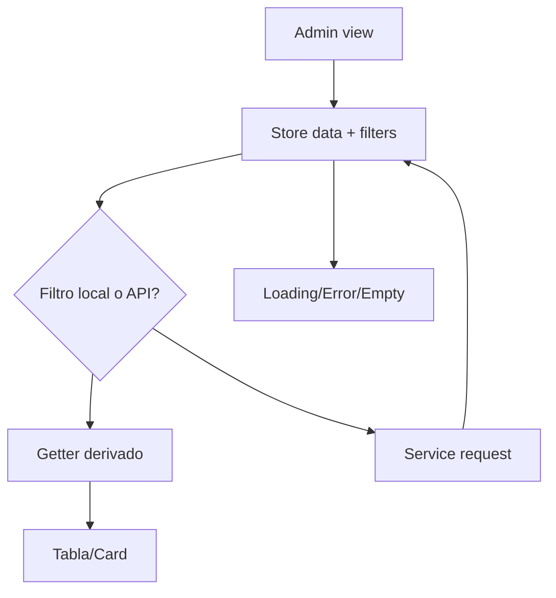

# Diagrama — Issue 08

Antes: datos y filtros dentro de componentes. Después: estado y transporte separados de presentación.

La vista no debe construir URLs ni transformar errores del transporte por su cuenta.
