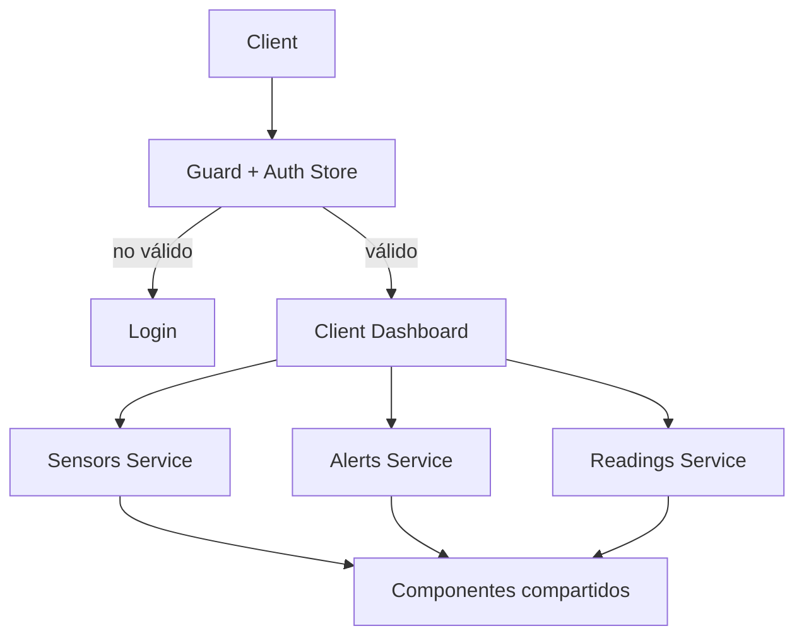

# Diagrama — Issue 09

Antes: cliente sin área privada. Después: dashboard scoped, protegido y reutilizable.

El guard controla navegación y el backend controla autorización; el dashboard no debe duplicar esa seguridad.
