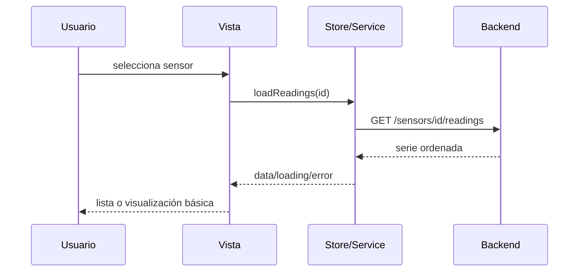

# Diagrama — Issue 10

```mermaid
sequenceDiagram
 participant U as Usuario
 participant V as Vista
 participant S as Store/Service
 participant API as Backend
 U->>V: selecciona sensor
 V->>S: loadReadings(id)
 S->>API: GET /sensors/id/readings
 API-->>S: serie ordenada
 S-->>V: data/loading/error
 V-->>U: lista o visualización básica
```

Antes: solo valor actual. Después: evolución histórica lista para análisis futuro.

La visualización consume una serie ya normalizada y no conoce la implementación HTTP.
