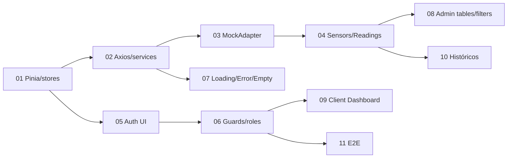

# Documentación de issues de Lylia

Esta documentación corresponde a las 11 issues definidas en [`scripts/create_lylia_issues.sh`](../../scripts/create_lylia_issues.sh). Cada issue contiene:

- `01-issue.md`: objetivo, problema, alcance, dependencias, decisiones y aceptación.
- `02-conceptos.md`: conceptos aislados y relacionados, con tiempos de aprendizaje.
- `03-diagrama.md`: antes/después y flujo técnico en Mermaid.
- `04-implementacion.md`: fases, verificaciones y errores frecuentes.

## Orden recomendado

Florinda construye la presentación; User04 coordina integración visual y backend. Lylia concentra estado, comunicación, adaptación de datos, autenticación frontend y pruebas de flujo.

